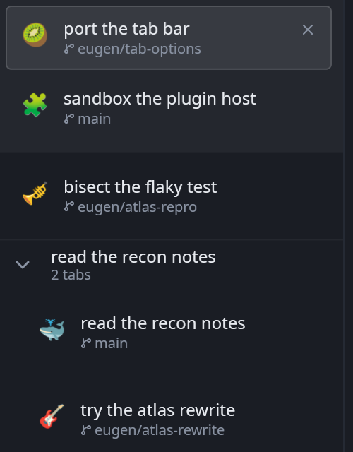
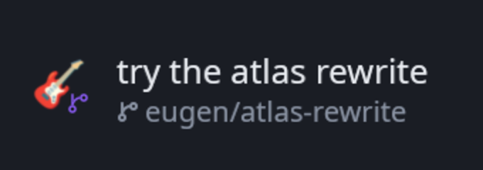

# Emoji

An emoji at the head of every [Crook](https://github.com/theguriev/crook) tab, in place of the
status dot — as a plugin the terminal does not carry.



The same tab gets the same emoji every time. Not random per frame and not random per launch:
the mark is a remainder over a number the host gives the plugin for each row, and that number
is the same for one project today and next week. So the checkout you think of as the kiwi one
stays the kiwi one.

## What it is allowed to do, which is nothing

A sandboxed Crook plugin has no filesystem, no network, no clock and no thread, and can only
reach the machine by *asking* the host for something a person allowed. This one asks for
nothing at all, and the Plugins page has nothing to offer you: its manifest carries an empty
list of capabilities.

That sounds impossible for a plugin that draws a mark per tab, and it is the interesting part.
The host hands a contribution to a row slot **one number per row**: the same number for one tab
every time, a different one for the tab beside it, salted with this plugin's own id so two
plugins cannot compare notes about which of their rows are the same row. Nothing about the tab
can be read back out of it. A table of sixty-four emoji and a remainder is the whole plugin.

So it cannot tell you what any of your tabs are called, where they are working, or what your
agents are doing — and it does not have to.

## Install

Download `plugin.wasm` from the [latest release](https://github.com/theguriev/crook-emoji/releases/latest)
and put it where Crook looks:

```sh
crook --install-plugin plugin.wasm
```

Or by hand, which is the same thing:

```sh
mkdir -p ~/.local/share/crook/plugins/theguriev.emoji
cp plugin.wasm ~/.local/share/crook/plugins/theguriev.emoji/
```

On macOS that directory is `~/Library/Application Support/crook/plugins/`, and on Windows
`%APPDATA%\crook\plugins\`. Start Crook and the dots are emoji. There is nothing to allow.

To stop: **Settings → Plugins → Emoji** and turn the switch off, or delete the directory. The
dots come back, because the dot is what Crook draws when nothing has taken the slot.

## How it works

Crook's tab panel reserves 24 pixels at the head of every row. That box is a *slot* —
`tab.row.mark` — declared by the terminal's own `crook/tabs` plugin, and the status dot is what
the host draws there when nothing has claimed it. This plugin claims it, and answers with a
`Node::Text` holding one emoji.

It names no colour, no pixel and no font. `Size::Body` in that slot is whatever the host thinks
a mark is in the window it is drawing, at the display scale it is drawing at, which is why this
plugin will still be the right size in a Crook nobody has written yet.

The slot holds one thing, so a plugin that wants it takes it: if you install another plugin
that also draws a tab's mark, the one with the lower `order` wins and Crook's Plugins page says
so. The **badge on the corner** is a slot of its own, so a plugin like
[crook-worktree](https://github.com/theguriev/crook-worktree) can add a mark without taking
this one's place:



## The table

Sixty-four marks, chosen by three rules that each threw out more candidates than they kept:

- **One code point each.** No flags, no keycaps, no skin tones, no zero-width joins — a family
  is seven code points and a shaper that fails to join them draws all seven.
- **No variation selectors.** `⭐` and `☂` need a `U+FE0F` after them to be pictures rather than
  text, and a terminal that draws the text form puts a grey outline where a mark should be.
- **Different at sixteen pixels.** Two emoji that are both a small round fruit are one emoji at
  that size, so the table is spread across creatures, plants, food, weather and objects.

They are in [`crates/emoji/src/marks.rs`](crates/emoji/src/marks.rs), and the rules are
assertions in the tests beside it rather than a promise in this file.

## Building it

```sh
cargo test --workspace
cargo build --release --target wasm32-unknown-unknown
cp target/wasm32-unknown-unknown/release/emoji.wasm plugin.wasm
```

`crates/crook_plugin_api` is a **copy** of the same directory in Crook, vendored because a
plugin anybody can build cannot depend on a repository they cannot clone. `ABI_VERSION` is what
keeps the two honest: a copy that has drifted is a plugin the host refuses by number, at load,
with a line saying which version each side speaks.

Everything except `sys.rs` builds for the host, which is why `cargo test` runs the part that
decides anything without a terminal to install a plugin into.

## Licence

MIT.
